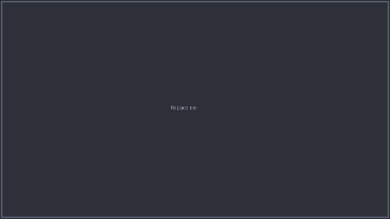
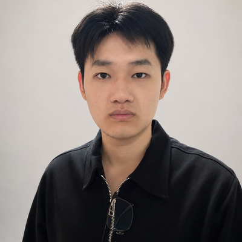
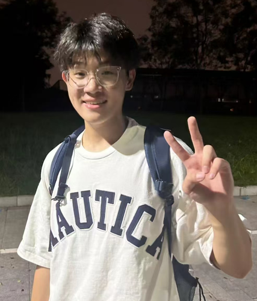
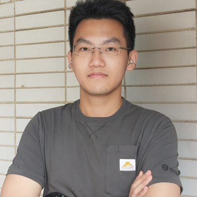

# Active Cabin OS · 智慧驾驶座舱

> 面向舱驾一体场景的端云协同多模态智能座舱主动服务系统设计研究

**South China University of Technology** · 华南理工大学

<p>
  
  
  
  
  
  
</p>

**Active Cabin OS** 是一套面向「舱驾一体」的下一代智能座舱系统：把 **CARLA 自动驾驶仿真**、**3840×590 超宽三联屏 HMI**、**端到端实时语音助手 NOVA** 与 **火山引擎云端大模型** 串成一条完整的端云协同链路。用户只需一句「有点热」「赶不上飞机了」，系统就能**听懂模糊意图、自动规划多步服务**——同时调好空调、座椅通风、氛围灯，或一键设好导航并拉起出行服务卡片。座舱不再被动等指令，而是**主动感知、主动服务**。

> 本项目为华南理工大学本科毕业设计 / 学科竞赛作品，覆盖仿真、感知可视化、人机交互、云端 AI 与硬件在环（MOZA 力反馈方向盘）全链路。

---

## Showcase

<!-- 演示视频（横向，占满一整行）：在 GitHub 网页编辑器中直接把 .mp4 拖拽替换下面的占位图即可自动嵌入 -->

<div align="center">
  <br>
  <sub><i>Demo video — drag an <code>.mp4</code> here in the GitHub web editor to replace</i></sub>
</div>

<table>
  <tr>
    <td align="center" width="50%">
      <br>
      <sub><i>System overview — replace with screenshot</i></sub>
    </td>
    <td align="center" width="50%">
      <br>
      <sub><i>HMI interface — replace with screenshot</i></sub>
    </td>
  </tr>
  <tr>
    <td align="center" width="50%">
      <br>
      <sub><i>ADAS 3D visualization — replace with screenshot</i></sub>
    </td>
    <td align="center" width="50%">
      <br>
      <sub><i>NOVA voice assistant — replace with screenshot</i></sub>
    </td>
  </tr>
</table>

---

## Team

### Advisor

<div align="center">
  <br>
  <b>Prof. Ouyang Bo</b> (欧阳波)<br>
  <sub>Faculty Advisor · Associate Professor</sub>
</div>

### Core Members

<table>
  <tr>
    <td align="center" width="33%"></td>
    <td align="center" width="33%"></td>
    <td align="center" width="33%"></td>
  </tr>
  <tr>
    <td align="center"><b>Pan Zilong</b> (潘子龙)</td>
    <td align="center"><b>Chen Shiyu</b> (陈诗雨)</td>
    <td align="center"><b>Zhao Hanyue</b> (赵寒玥)</td>
  </tr>
  <tr>
    <td align="center"><sub>Team Lead · AI cloud-edge integration, HW/SW system integration</sub></td>
    <td align="center"><sub>CARLA simulation, hardware emulation</sub></td>
    <td align="center"><sub>HMI design & development, theoretical research</sub></td>
  </tr>
</table>

### Members

<table>
  <tr>
    <td align="center" width="33%"></td>
    <td align="center" width="33%"></td>
    <td align="center" width="33%"></td>
  </tr>
  <tr>
    <td align="center"><b>Jia Junsong</b> (贾竣淞)</td>
    <td align="center"><b>Ji Yicheng</b> (计邑澄)</td>
    <td align="center"><b>Li Zhecheng</b> (黎哲成)</td>
  </tr>
  <tr>
    <td align="center"><sub>Cockpit experimental platform design & modeling</sub></td>
    <td align="center"><sub>Software & hardware development</sub></td>
    <td align="center"><sub>Human-factors experiment design, cockpit platform construction</sub></td>
  </tr>
</table>

## 核心亮点

| 能力 | 说明 |
|------|------|
| **主动服务 · 模糊意图识别** | 一句「好热 / 有点累 / 赶飞机 / 想喝奶茶」即可触发多步骤服务编排——自动联动空调、座椅通风、氛围灯、导航、出行/支付卡片，座舱从「被动响应」升级为「主动关怀」。 |
| **NOVA 端到端实时语音** | 基于火山 RTC 的 S2S 端到端语音大模型，浏览器端直接收音/播放，毫秒级响应；自定义唤醒词「NOVA」+ AudioWorklet VAD，免按键随叫随到。 |
| **大模型 Function Calling** | 方舟 LLM 输出结构化工具调用，覆盖座舱控制、媒体导航、面板服务、3D 展车、状态查询五大类动作，指令直达前端执行。 |
| **ADAS 三维感知可视化** | Three.js 实时重建道路路网、周围车辆/行人、红绿灯与车道线，自车视角随动；数据源自 CARLA 真实感知或 Mock 仿真。 |
| **Unity WebGL 三维展车** | 可语音控制的交互式 3D 整车——切换内饰/外观/宇航员视角、开关车门车窗，沉浸式座舱体验。 |
| **认知负荷自适应 HMI** | 根据车速、周围车辆数、TTC、路况实时评估驾驶员认知负荷，动态简化界面，降低分心风险。 |
| **硬件在环（MOZA）** | 集成 MOZA 力反馈方向盘，CARLA 驾驶手感真实可玩；支持 `--no-moza` 纯软件演示。 |
| **端云协同架构** | 边缘端（CARLA/HMI/状态管理）+ 云端（RTC/LLM/ASR）解耦协作，30Hz 车辆状态、10Hz ADAS 感知经 WebSocket 实时下发。 |

## 系统架构

```
┌─────────────────────────────────────────────────────────┐
│  浏览器 HMI（3840×590 超宽三联屏）                       │
│  ┌──────────┬──────────────┬───────────────┐            │
│  │ ADAS 3D  │  导航 / Unity │  座舱卡片/服务 │            │
│  └──────────┴──────────────┴───────────────┘            │
│  + NOVA 语音助手（RTC SDK + 唤醒词 + Function Calling）  │
└────────────────────┬────────────────────────────────────┘
                     │ WebSocket（状态/动作）+ REST API（语音）
┌────────────────────┴────────────────────────────────────┐
│  FastAPI 边缘后端（edge/hmi_server/）                     │
│  - 车辆状态 / ADAS 感知推送（30Hz / 10Hz）               │
│  - 语音 API（/api/voice/start|stop|token|fc-execute）    │
│  - 唤醒词 WebSocket（/ws/wake）                          │
└────────────────────┬────────────────────────────────────┘
                     │
┌────────────────────┴────────────────────────────────────┐
│  火山引擎云服务                                           │
│  - RTC 房间（S2S 端到端语音大模型）                        │
│  - 方舟 LLM（Function Calling 工具调用）                  │
│  - ASR 流式识别（唤醒词检测）                              │
└────────────────────┬────────────────────────────────────┘
                     │
┌────────────────────┴────────────────────────────────────┐
│  CARLA 仿真器 / Mock 数据                                │
│  - 车辆状态、周围车辆/行人、路网、红绿灯                   │
└─────────────────────────────────────────────────────────┘
```

## 快速开始

```bash
# 1. 安装依赖
pip install -r requirements.txt

# 2. 配置密钥（火山引擎 RTC / 方舟 LLM）
cp .env.example .env   # 然后填入你的密钥

# 3. 启动
python main.py --web-hmi --mock-carla   # Mock 数据 + Web HMI + NOVA 语音（推荐先跑这个）
python main.py --web-hmi                 # 连接 CARLA 仿真器
python main.py --hmi-only                # 仅 HMI（无 AI、无 CARLA）
```

启动后浏览器访问 `http://localhost:8080`。

> **硬件在环演示**：`hmi_integrated_new/` 提供集成 MOZA 力反馈方向盘 + 认知负荷自适应 + 双 HMI 切换的整合版，`python hmi_integrated_new/main.py`（无方向盘时加 `--no-moza`）。

## 目录结构

```
smart_cockpit/
├── main.py                      # 主入口（端云协同启动编排）
├── config/settings.py           # 全局配置（从 .env 加载）
│
├── cloud/voice/
│   └── rtc_service.py           # 火山 RTC API（Start/Stop/Update VoiceChat + Token）
│
├── edge/hmi_server/
│   ├── server.py                # FastAPI 主服务 + WebSocket 状态推送
│   ├── voice_api.py             # 语音 API 路由（/api/voice/*）+ Function Calling 执行
│   └── wake_ws.py               # 唤醒词 WebSocket（/ws/wake）
│
├── edge/state/
│   ├── vehicle_state.py         # 车辆状态管理（速度/转向/ADAS 感知）
│   ├── cabin_state.py           # 座舱状态管理（空调/氛围灯/模式）
│   └── service_executor.py      # FC 执行器（WebSocket 广播动作给前端）
│
├── edge/carla/bridge.py         # CARLA 仿真器桥接（感知采集 + 路网）
│
├── hmi/static/                  # 前端 HMI（三联屏 + ADAS + Unity + 语音）
│   ├── index.html / app.js / styles.css
│   ├── voice.js                 # NOVA 语音前端（RTC + 唤醒词 + FC）
│   ├── wake-processor.js        # AudioWorklet VAD 处理器
│   ├── volc-rtc.min.js          # 火山 RTC SDK
│   └── unity/                   # Unity WebGL 3D 展车场景
│
├── hmi_integrated_new/          # 硬件在环整合版（MOZA + 认知负荷 + 双 HMI）
└── docs/                        # 团队照片、Showcase 素材
```

## 技术栈

- **仿真**：CARLA Simulator
- **后端**：Python · FastAPI · WebSocket · asyncio
- **前端**：原生 JS · Three.js（ADAS 3D）· Unity WebGL（3D 展车）
- **云端 AI**：火山引擎 RTC（S2S 端到端语音）· 方舟 LLM（Function Calling）· 流式 ASR
- **硬件**：MOZA 力反馈方向盘

## 协议文档

- [`VOICE_FC_PROTOCOL.md`](VOICE_FC_PROTOCOL.md) — NOVA 语音 Function Calling 工具调用协议


